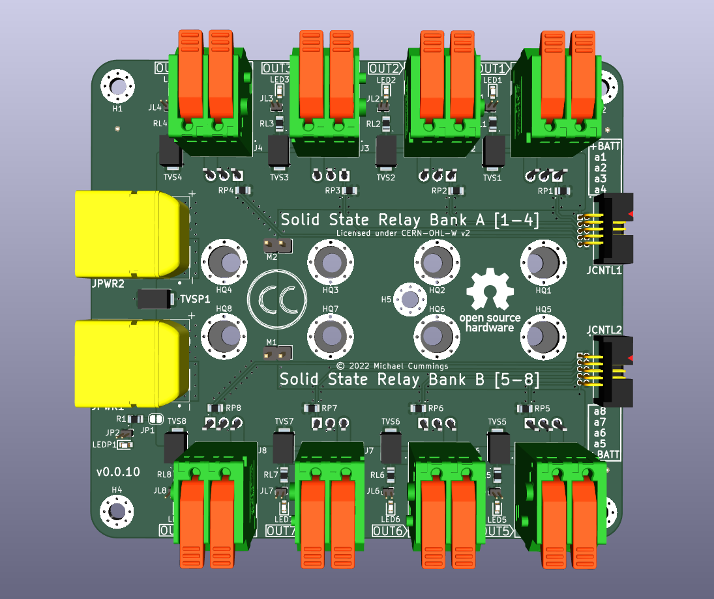
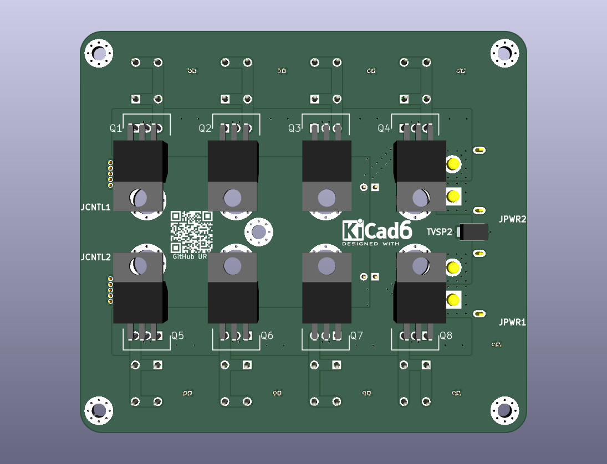

# Solid State Relays - 12Volts

 

 

The Solid State Relays - 12Volts is one of the open hardware solid state relay
PCB of my Dragon Mobile GitHub organization with a goal to make
useful hardware with associated firmware and software for the tiny home, van
life and maker communities.

## Visual 3D examples

Top view 
 
Bottom view 
 

## Description

The board consist of three main electronic sections: Power In,
Control In / Power Out,
and the Solid State Relays which are divided into two banks of four output
channels.
There are two mechanical sections as well: Mounting Holes, and the
eight MOSFET Mounting Access Holes.

### Power In

The main 12 volt power source for the rest of the board enters via the
JPWR1 and optional JPWR2 XT-60PW-M connectors. Each is rated for up to 35A but
may support 40-50A loads for brief periods in practice with good cooling.
Care should be taken to not connect or disconnect the power when any outputs
are active as this may cause some arcing within the connector which will
shorten its life span. This will be especially noticable with large inductive
loads.

The two Transient-Voltage-Suppression (TVS) diodes: TVSP1 and optional TVSP2
provide protection against high voltage spikes from entering the board through
the power source. Additionally they can act as reverse polarity protection by
shorting the incorrectly wiring source and blow its fuse. Care should be taken
to ensure the 12 volt wire is properly fused.

The final part of the Power In section is the highly recommended but optional
power applied/on LED circuit. The LEDP1 should light up any time power is
connected to the board to give a quick visual indicator. Optionally the onboard
LED can be replaced by connecting an external LED via the optional JP2 pin
header. Connecting both LEDP1 and an external LED is not recommended. R1 is the
current limiting resistor for the LED and can be replaced with 0Ω one when
an external resistor is used on the JP2 circuit.
By cutting the trace between the pads of JP1 the indicator circuit can be
disabled. Additionally by doing this and soldering two leads to the pads an
external switch could be used to turn the indicator on and off as needed.

#### Optional components

The board is design to supply 30-40A across all outputs without the addition
of JPWR2 and TVSP2 to save costs. For higher currents both the additional
connector and TVS should be used. It is also recommended you increase the
board copper plating to 3oz (105μm). An alternative but not recommended and
more risky way to increase current capacity is by soldering some point to point
jumper wires from near the power connectors and the center lead of the output
FETs and from the output of the FETs to the leads of the output connectors.

TVSP2 is the only surface mount component on the bottom side of the board.

### Control In / Power Out

This section provides the connectors JCNTL1 and JCNTL2 which interfaces the
control signals from the external circuits to the output FETs.
The external controls should be either electronic open drain (collector) or
mechanical switches which pull their output to ground when active.
The external controls may also switch between the +BATT voltage and ground but
an active low only signal is expected and preferred when possible.
Each connector is connected to a single bank of 4 output channels allowing each
one to be used with a different control if needed though a single control
connected to and controlling both is the expected configuration.

Additionally the connectors can each be used to supply power of +BATT volts at
1A max to external circuits.
Normally this is used to supply power to an external control boards like the
co-designed and recommended [picow_ssr_control] or [we_ssr_control] boards.

### Solid State Relays

This is the main section of the circuit board and contains most of the
components. There are 8 independent solid state relay circuits which are
designed to work the same. The relays outputs are laid out as two banks of
four channels each on the two longer edges of the board to allow easy access.
A single channel will be described next since other than their position and
names etc. the design is the same.

#### Channel description

The OUT1 channel will be used in this description. The switching (relay)
component is Q1 a P-channel IRF4905 MOSFET which electrical connects the +BATT
voltage to the output connector J1 (OUT1) when activated. The pullup resistor
RP1 keeps the FET off when there is no low input driving the gate via the
control input from the a1 pin of the JCNTL1 connector. The expected control
input is a open drain (collector) output which only actively drives the input
to ground and allows its output to float otherwise.

*Note* that Q1 is mounted on the bottom side of the board and bent over to
allow easy attachment to a large heat sink which is required. Look at the
picture of the bottom of the board in the Visual 3D examples section of this
README to better understand what it looks like when bent over to mounting.

** WARNING ** the metal tab and back of Q1 are at +BATT and need to be
electrically isolated from the heat sink if it is grounded while still
maintaining a good thermal contact.

The output is protected from most high voltage and reverse voltage spikes by
TVS1 a unidirectional Transient-Voltage-Suppression diode. It is mostly there
to protect against ESD and the voltage spikes commonly seens when switch off
inductive loads which could damage Q1 if they exceeded its own internal
protections.

The final three components: RL1, LED1, and the optional JL1 provide a quick
visual indicator for when the output is active. RL1 is the current limiting
resistor for the LED. Like with the power indicator circuit the indicator
circuit is all optional but highly recommended. When an LED is connected via
JL1 the internal LED should not be used.

### Mounting Holes

A US letter sized mounting template can be found in [MountingTemplate].

In a typical application the board will be mounted with brass or stainless
steel standoff which are tapped into a vertical aluminum, copper, or brass
backplate which also acts as the heat sink for the output FETs and all of
this is inside of a larger electrical enclosure or cabinet.
The mounting holes are sized for M3 hex (preferred) or round Male-Female ended
standoffs which should be 5-10mm high to allow the correct mounting of the
output FETs. the shortest standoff that doesn't cause the body to contact the
board and allow the legs to be bent at a right angle just pass the "neck" is
best.
In most cases this should be 5-6mm high but can end up as high as 10mm
depending on the insulators used.

The [picow_ssr_control] and [we_ssr_control] boards have been designed to mount
directly on top of / in front of this board with additional 20mm M-F standoffs
which would replace the normal M3 pan head screws used to secure the board at
H1, H4, and H5.

### MOSFET Mounting Access Holes

The last mechanical section are the access holes that were added to make
mounting the FET to an underlaying heat sink easier. They can also be found
on the [MountingTemplate]. On the template you will see outlines for a
typical silicone insulators.

*Note* one top corner of the HQ2 and HQ6 insulators may interfere with mounting
hole H5 and need to be trimmed back or bent up a little if flexible enough to
allow complete tighten of the standoff and not cause the board to bow up in the
middle. By using a magnetic screwdriver you should be able to pass the screw,
lock, and plastic shoulder washers through the holes in the board and FET to be
tighten down.
A little silicone or thermal grease can help keep the washers in place without
cause other issues.

## Contributing

Contributors are welcome.
Please note that this project has a [Contributor Covenant Code of Conduct].
By participating in this project you agree to abide by its terms.

All intentionally contributed hardware will be considered to be contributed
under the [CERN] license without any additional terms or conditions.

All intentionally contributed code will be considered to be contributed
under a [MIT] license without any additional terms or conditions.
Please include your information in a comment on all code files for the copyright
etc.

All intentionally contributed documentation, CAD files and libraries, footprints,
artwork or non-code text like this README etc. will be considered to be
contributed under the same [CC-BY-SA] license without any additional terms or
conditions.

Pull requests are always welcome. For major changes, please open an issue first
to discuss what you would like to change.
Please make sure to update or add tests as appropriate for all software changes.

## Licenses

 

All hardware is licensed under the

  * [CERN] - CERN-OHL-W-2.0
  
You can find a copy of the CERN Open Hardware License - Weakly-reciprocal v2.0
in the [LICENSE-CERN-OHL-W-2] file and the how-to guide in the
[CERN-HOWTO_GUIDE] file.

All code is licensed under the

  * [MIT] - MIT License

You can find a copy of the license in the [LICENSE-MIT] file.

All documentation like this README is licensed under the Creative Commons
Attribution-ShareAlike 4.0 International License (CC-BY-SA).

All original CAD files and libraries, footprints, and artwork are also licensed
under the
Creative Commons Attribution-ShareAlike 4.0 International License (CC-BY-SA).
You can find a copy of the [CC-BY-SA] license in the [LICENSE-CC-BY-SA] file.

If after reading the above license files, how-tos, and related FAQs on the
linked license sites on how they apply to the project please either open an
issue or contact me (Michael Cummings) via my Github email and I will try
to guided you through my understanding of how it works.

[CC-BY-SA]: http://creativecommons.org/licenses/by-sa/4.0/
[CERN]: https://ohwr.org/project/cernohl/wikis/Documents/CERN-OHL-version-2
[CERN-HOWTO_GUIDE]: docs/cern_ohl_w_v2_howto.pdf
[Contributor Covenant Code of Conduct]: CODE_OF_CONDUCT.md 
[LICENSE-CC-BY-SA]: LICENSE-CC-BY-SA
[LICENSE-CERN-OHL-W-2]: CERN-OHL-W-2
[LICENSE-MIT]: LICENSE-MIT
[MIT]: https://opensource.org/licenses/MIT
[MountingTemplate]: docs/MountingTemplate.pdf
[picow_ssr_control]: https://github.com/dragon-mobile/picow_ssr_control
[we_ssr_control]: https://github.com/dragon-mobile/we_ssr_control

Copyright &copy; 2022-2023, Michael Cummings 

